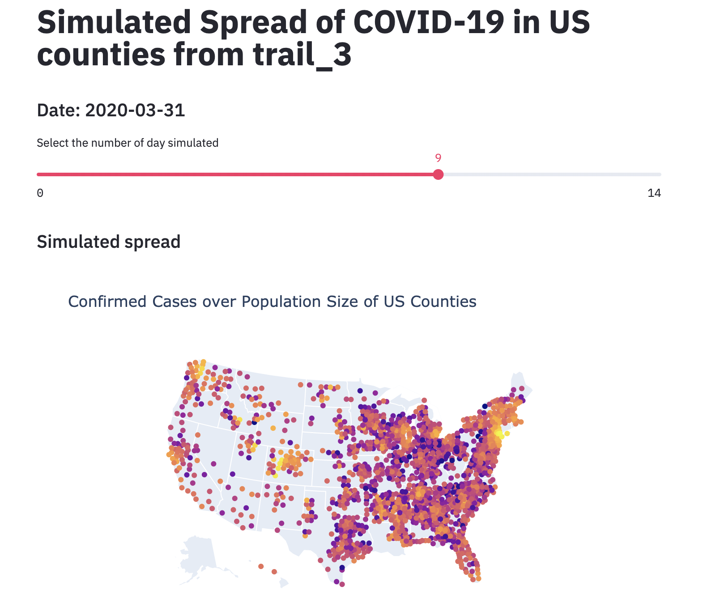

# Covid-19 Kerala Spread
A geographic-spread model of Covid-19 virus for all districts in Kerala.

Currently incomplete but the general idea is layed out

The source of COVID-19 data is a great [website](https://coronavirus.1point3acres.com/?from=groupmessage&isappinstalled=0) made by [1Point3Acres](https://www.1point3acres.com)

# Demo
</img>
[Online Demo](https://covid19-spread.herokuapp.com)\
or\
To run it yourself:
```
git clone git@github.com:Rosversity/PandemicPredictionModel.git
pip install -r requirements.txt
python model/spread.py
streamlit run view_trail.py
```

You can modify the settings.ini file to change the parameters for better results

You can download new data by running
```
python data/virus_data_pipeline/download.py
```

# Welcome to contribute!
